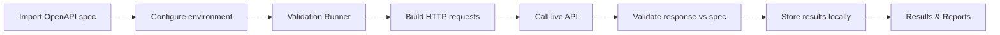

<p align="center">
  
</p>

<h1 align="center">APIVerify</h1>

<p align="center">
  <strong>Validate your REST APIs against OpenAPI & Swagger — locally, visually, and at scale.</strong>
</p>

<p align="center">
  Desktop app for importing specs, configuring environments, running batch validations, and exporting compliance reports — no cloud required.
</p>

<p align="center">
  <a href="https://apiverify.app"></a>
  
  
  
  
</p>

---

## Why APIVerify?

OpenAPI specs describe what your API *should* do. Production APIs often drift — wrong status codes, missing fields, broken auth, environment-specific URLs. APIVerify closes that gap by **executing real HTTP requests** and **validating responses against your specification**, with everything stored on your machine.

| | Traditional API clients | APIVerify |
|---|---|---|
| **Spec-aware** | Manual setup per endpoint | Endpoints extracted from OpenAPI/Swagger |
| **Validation** | Eyeball JSON responses | JSON Schema + status code checks via AJV |
| **Batch runs** | One request at a time | Validate entire specs in one run |
| **Environments** | Per-request config | Reusable DEV / QA / UAT / PROD profiles |
| **Reports** | Copy-paste | Export HTML, JSON, CSV |
| **Privacy** | Often cloud-synced | 100% local SQLite database |

---

## Features

### Import & explore specifications
- Import **OpenAPI 3.x / Swagger** from **JSON or YAML** — paste content or **browse local files**
- Parse and dereference specs with `@apidevtools/swagger-parser`
- Browse paths, methods, parameters, and schemas in a split explorer view

### Workspaces & environments
- Organize work into **workspaces** (projects) with isolated specs, envs, and history
- Configure **environment variables**, base URLs, default headers, and auth per environment
- Support for **Bearer**, **Basic**, **API Key**, and **OAuth2 client credentials** (token endpoint + verify flow)

### Validation runner
- Select workspace, environment, and spec — auto-fills when you have exactly one of each
- Pick endpoints to validate or run the full spec
- Real-time progress, pass/fail summary, and response times
- Cancel long-running batches

### Results & reporting
- Grouped **validation history** with expandable request/response details
- Collapsible sections: headers, query params, request body, errors, response body
- Export runs as **HTML**, **JSON**, or **CSV** reports
- Delete individual run groups with confirmation

### Developer experience
- Modern **React + MUI** UI with light/dark theme
- Structured error handling with friendly messages
- **119+ automated tests** (Vitest) covering engine, IPC, parsers, and UI utilities
- Secure Electron architecture: context isolation, sandbox, typed IPC allowlist

---

## How it works



1. **Import** your Swagger/OpenAPI file into a workspace.
2. **Configure** an environment (base URL, variables, authentication).
3. **Run** validation — APIVerify sends requests and checks status codes + JSON schemas.
4. **Review** failures with full request/response context.
5. **Export** reports for QA sign-off, CI evidence, or stakeholder review.

---

## Screenshots

> Add screenshots here before publishing — suggested captures: Dashboard, API Specifications import, Validation Runner, Results detail panel, Environment auth tab.

| API Specifications | Validation Runner | Results |
|:---:|:---:|:---:|
| *screenshot* | *screenshot* | *screenshot* |

---

## Tech stack

| Layer | Technology |
|-------|------------|
| Desktop shell | [Electron](https://www.electronjs.org/) 39 |
| UI | [React](https://react.dev/) 19, [MUI](https://mui.com/) 9 |
| Build | [electron-vite](https://electron-vite.org/), [Vite](https://vitejs.dev/) 7 |
| Language | [TypeScript](https://www.typescriptlang.org/) 5.9 |
| State | [Zustand](https://zustand.docs.pmnd.rs/) |
| Database | [better-sqlite3](https://github.com/WiseLibs/better-sqlite3) (local) |
| Spec parsing | [@apidevtools/swagger-parser](https://github.com/APIDevTools/swagger-parser) |
| Schema validation | [AJV](https://ajv.js.org/) 8 + ajv-formats |
| HTTP client | [Axios](https://axios-http.com/) |
| Tests | [Vitest](https://vitest.dev/) |

---

## Architecture

```
apiverify/
├── src/
│   ├── main/           # Electron main process (IPC, DB, HTTP, validation runner)
│   ├── preload/        # Secure contextBridge API
│   ├── renderer/       # React UI (pages, components, store)
│   └── shared/         # Validation engine, auth, reports, models, errors
├── tests/              # Unit & integration tests
├── resources/          # App icons
└── build/              # Packaging assets (entitlements, icons)
```

- **Main process** owns filesystem access, SQLite, outbound HTTP, and OpenAPI parsing.
- **Renderer** never touches the disk directly — all access goes through a typed IPC allowlist.
- **Shared engine** builds requests from specs + environments and validates responses with AJV.

---

## Getting started

### Prerequisites

- **Node.js** 20+ (LTS recommended)
- **npm** 10+
- **macOS**: Xcode Command Line Tools (for native modules)
- **Windows / Linux**: build tools for `better-sqlite3` ([node-gyp](https://github.com/nodejs/node-gyp) requirements)

### Install

```bash
git clone https://github.com/your-org/apiverify.git
cd apiverify
npm install
```

### Development

```bash
npm run dev
```

Opens the app with hot reload for the renderer and main process.

### Production preview

```bash
npm start
```

---

## Build & distribute

### macOS (fast local build, unsigned)

```bash
npm run dist:fast
# Output: dist/mac-arm64/APIVerify.app (or dist/mac/APIVerify.app)
```

### macOS DMG (unsigned)

```bash
npm run dist:unsigned
```

### macOS signed release

```bash
npm run dist:signed
```

Requires Apple Developer signing certificates configured in your environment.

### Windows

```bash
npm run build:win
```

### Linux (AppImage + deb)

```bash
npm run build:linux
```

### Interactive build helper

```bash
./build_deploy.sh
```

---

## Scripts reference

| Command | Description |
|---------|-------------|
| `npm run dev` | Start development server |
| `npm run build` | Typecheck + production build |
| `npm run dist:fast` | Fast unsigned macOS `.app` |
| `npm run dist:unsigned` | Unsigned macOS DMG |
| `npm run dist:signed` | Signed macOS release (DMG + ZIP) |
| `npm test` | Run Vitest test suite |
| `npm run typecheck` | TypeScript check (main + renderer) |
| `npm run lint` | ESLint |
| `npm run format` | Prettier |

---

## Authentication support

| Method | Status |
|--------|--------|
| None | Supported |
| Bearer token | Supported |
| HTTP Basic | Supported |
| API Key (header / query) | Supported |
| OAuth2 client credentials | Supported (token endpoint + verify) |
| Custom headers | Supported |
| AWS Signature V4 | Planned |
| OAuth2 authorization code | Planned |

Environment variables use `{{variableName}}` interpolation in URLs, headers, and bodies.

---

## Privacy & security

- All project data, specs, environments, and validation history are stored in a **local SQLite database** on your machine.
- No telemetry or cloud sync is required to use the app.
- Electron runs with **context isolation**, **sandbox**, and a **strict IPC channel allowlist**.
- Sensitive fields (tokens, passwords) are masked in the UI and redacted in logs.

---

## Testing

```bash
npm test
```

Covers OpenAPI parsing, validation engine, auth strategies, IPC validators, repositories, report generation, and renderer utilities.

---

## Recommended IDE setup

- [VS Code](https://code.visualstudio.com/)
- [ESLint](https://marketplace.visualstudio.com/items?itemName=dbaeumer.vscode-eslint)
- [Prettier](https://marketplace.visualstudio.com/items?itemName=esbenp.prettier-vscode)

Debug configurations are included in `.vscode/launch.json`.

---

## Roadmap

- [ ] AWS Signature V4 authentication
- [ ] Full OAuth2 authorization-code flow
- [ ] CI/CD plugin or headless CLI mode
- [ ] Scheduled / recurring validation runs
- [ ] OpenAPI diff between spec versions

---

## Contributing

Contributions are welcome. Please open an issue to discuss significant changes before submitting a pull request.

1. Fork the repository
2. Create a feature branch (`git checkout -b feature/amazing-feature`)
3. Commit your changes (`git commit -m 'Add amazing feature'`)
4. Push to the branch (`git push origin feature/amazing-feature`)
5. Open a Pull Request

Ensure `npm run typecheck`, `npm run lint`, and `npm test` pass before submitting.

---

## Support

- **Website:** [apiverify.app](https://apiverify.app)
- **Issues:** [GitHub Issues](https://github.com/your-org/apiverify/issues) *(update with your repo URL)*

---

<p align="center">
  <sub>Built for API engineers, QA teams, and platform developers who treat OpenAPI as the contract.</sub>
</p>

<p align="center">
  <strong>APIVerify</strong> — Ship APIs that match the spec.
</p>
